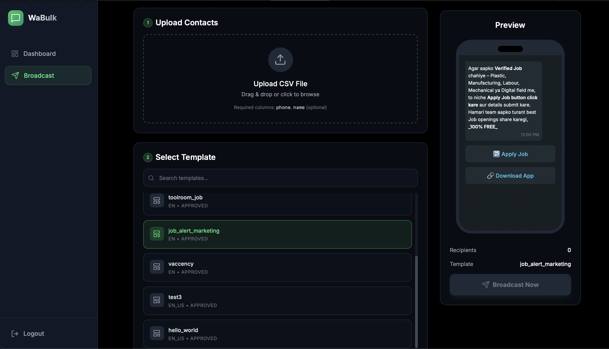

# WhatsApp Bulk Message Sender - FREE (Official API) 🚀

**The Ultimate Open-Source Dashboard for WhatsApp Marketing & Broadcasts.**

[](https://opensource.org/licenses/MIT)
[](https://nextjs.org/)
[](https://tailwindcss.com/)

**WaBulkSender** is a premium, self-hosted solution for sending bulk WhatsApp messages using the **Official WhatsApp Cloud API**. Say goodbye to monthly subscriptions and per-message markups. Send thousands of messages directly through Meta's secure infrastructure.

Perfect for **Marketing Agencies**, **Small Businesses**, and **Developers** looking for a free, secure, and scalable WhatsApp marketing tool.

---

## ✨ Key Features

*   **📢 Bulk Broadcasting:** Upload CSV files and send messages to thousands of contacts instantly.
*   **🎨 Template Support:** Full compatibility with WhatsApp Templates (Headers, Media, Buttons, Flows).
*   **🔄 Dynamic Variables:** Personalize messages (e.g., "Hi {{Name}}") by mapping CSV columns to template variables.
*   **👁️ Real-time Preview:** See exactly how your message will look on a user's phone before sending.
*   **📊 Campaign Analytics:** Track success rates, failed numbers, and delivery status (powered by Firebase).
*   **🔐 Secure Authentication:** Built-in Firebase Email/Password login to protect your dashboard.


*(Screenshot: Broadcast Page)*
*   **💸 100% Free & Open Source:** No hidden fees. You only pay Meta directly for conversation charges (if applicable).

---

## 🛠️ Tech Stack

*   **Frontend:** [Next.js 14](https://nextjs.org/) (App Router)
*   **Styling:** [Tailwind CSS](https://tailwindcss.com/)
*   **Database:** [Firebase Firestore](https://firebase.google.com/)
*   **Auth:** [Firebase Authentication](https://firebase.google.com/docs/auth)
*   **API:** [WhatsApp Cloud API](https://developers.facebook.com/docs/whatsapp/cloud-api)

---

## 🚀 Quick Start Guide

Follow these steps to set up your own WhatsApp Bulk Sender in minutes.

### Prerequisites
*   **Node.js** (v18+)
*   **Firebase Account** (Free Tier)
*   **Meta Developer Account** (with a WhatsApp Business App)

### 1. Clone the Repository
```bash
git clone https://github.com/iamd2epak/WaBulkSender.git
cd WaBulkSender
```

### 2. Install Dependencies
```bash
npm install
```

### 3. Setup Environment Variables
Create a `.env.local` file in the root directory. Copy the keys from your Firebase Console and Meta Developer Portal.

```env
# Firebase Config (Required for Login & History)
NEXT_PUBLIC_FIREBASE_API_KEY=your_api_key
NEXT_PUBLIC_FIREBASE_AUTH_DOMAIN=your_project.firebaseapp.com
NEXT_PUBLIC_FIREBASE_PROJECT_ID=your_project_id
NEXT_PUBLIC_FIREBASE_STORAGE_BUCKET=your_project.appspot.com
NEXT_PUBLIC_FIREBASE_MESSAGING_SENDER_ID=your_sender_id
NEXT_PUBLIC_FIREBASE_APP_ID=your_app_id

# WhatsApp API (Optional - Can also be entered in the UI)
NEXT_PUBLIC_WHATSAPP_ACCESS_TOKEN=your_meta_access_token
NEXT_PUBLIC_WHATSAPP_PHONE_NUMBER_ID=your_phone_number_id
NEXT_PUBLIC_WHATSAPP_WABA_ID=your_waba_id
```

### 4. Run Locally
```bash
npm run dev
```
Visit `http://localhost:3000` to access your dashboard.

---

## ☁️ How to Deploy (Free)

You can deploy this app for free on **Netlify** or **Vercel**.

1.  Push your code to a **GitHub** repository.
2.  Import the project into Netlify/Vercel.
3.  **IMPORTANT:** Add the Environment Variables (from step 3) in your deployment settings.
4.  Deploy! Your app is now live and accessible from anywhere.

---

## 🔒 Security Note

*   **Credentials:** Your API keys are stored securely in your environment variables. They are never exposed to the client-side code (except for the necessary Firebase public config).
*   **Authentication:** The app uses Firebase Auth, ensuring only you can access the dashboard.

---

## 👨‍💻 Message from the Developer

> "Hello! I built this tool to help everyone send WhatsApp messages for free using the official API. Here is exactly how you can set it up in 5 minutes:
>
> **1. Get the Code:**
>    - Open your terminal and run: `git clone https://github.com/iamd2epak/WaBulkSender.git`
>    - Go into the folder: `cd WaBulkSender`
>    - Run `npm install` to download libraries.
>
> **2. Get Your Keys (The Important Part):**
>    - **Firebase:** Go to [console.firebase.google.com](https://console.firebase.google.com). Create a project.
>      - Enable **Authentication** (Email/Password).
>      - Create a **Firestore Database** (Start in Test Mode).
>      - Go to Project Settings to copy your `firebaseConfig` keys.
>    - **WhatsApp:** Go to [developers.facebook.com](https://developers.facebook.com). Create an App (Business > WhatsApp).
>      - In the API Setup panel, copy your `Access Token`, `Phone Number ID`, and `WABA ID`.
>
> **3. Connect the Keys:**
>    - Create a new file named `.env.local` in the project folder.
>    - Copy the keys from the 'Quick Start Guide' above.
>    - Paste your real values into `.env.local`.
>
> **4. Run it Locally:**
>    - Type `npm run dev` in your terminal.
>    - Open `http://localhost:3000`.
>    - Login with the user you created in Firebase Auth.
>
> **5. Go Live (Production):**
>    - Push your code to GitHub.
>    - Go to Netlify.com -> 'Add New Site' -> 'Import from Git'.
>    - **CRITICAL:** In Netlify Settings > Environment Variables, add ALL the keys from your `.env.local` file.
>    - Click Deploy. Done! 🚀"

---

<br>

| 🛑 **WANT YOUR OWN BRANDED VERSION?** 🛑 |
| :--- |
| **Need this project setup for your business? Don't want to deal with code?**<br><br>I can build and setup a **Custom Version** of this tool for you, completely branded with your **Logo, Name, and Colors**.<br><br>✅ **Full Installation & Setup** (Cloud or Local)<br>✅ **Custom Branding** (Your Logo & Name)<br>✅ **Priority Support** & Training<br>✅ **Custom Features** (Auto-Reply, Chatbots, etc.)<br><br>📩 **Contact me for a quote:** [99.iamdeepak@gmail.com](mailto:99.iamdeepak@gmail.com) |

<br>

## 🤝 Contributing

We love open source! If you have ideas for new features (like Schedule Broadcasts, Contact Groups, or Auto-Replies), feel free to fork the repo and submit a Pull Request.

## 📄 License

This project is licensed under the [MIT License](LICENSE) - free for personal and commercial use.

---

**Keywords:** WhatsApp Bulk Sender, Free WhatsApp Marketing Tool, WhatsApp Cloud API Dashboard, Open Source WhatsApp Bot, Next.js WhatsApp Starter, Firebase WhatsApp Integration.
